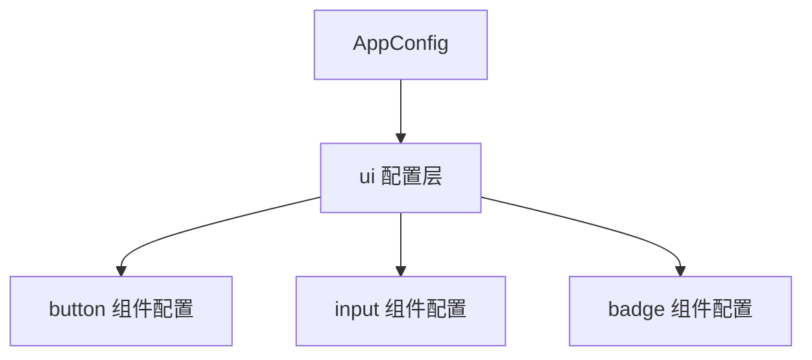

```typescript
/**
 * 是一个高度抽象的类型，用于在 Nuxt UI 框架中定义组件的配置结构。
 * @template T 从 #build/ui/* 导入的组件主题类型。
 * @template A 来自 @nuxt/schema 的基本 AppConfig 类型。
 * @template K 标识组件的唯一键（例如：'badge'）。
 * @template U AppConfig 中的顶层键名（默认为 'ui'，可选 'uiPro' 或 'uiPro.prose'）。
 */
export type ComponentConfig<
  T extends Record<string, any>,
  A extends Record<string, any>,
  K extends string,
  U extends 'ui' | 'uiPro' | 'uiPro.prose' = 'ui'
> = {
  AppConfig: ComponentAppConfig<T, A, K, U>
  variants: ComponentVariants<T & GetComponentAppConfig<A, U, K>>
  slots: ComponentSlots<T>
}
```

`ComponentConfig` 是一个高度抽象的类型，用于在 Nuxt UI 框架中定义组件的配置结构。它通过泛型参数实现了以下功能：

* 组件主题（T）：组件的默认配置。
* 应用配置（A）：整个应用的配置类型，用于覆盖组件的默认配置。
* 组件标识（K）：在应用配置中定位当前组件的配置。
* 配置路径（U）：在应用配置中定位UI配置的根键（支持多版本配置）。

最终，它导出三个关键部分：

* `AppConfig`：描述如何在应用配置中定义该组件的配置（覆盖规则）。
* `variants`：组件的变体，由默认主题和应用配置中的覆盖配置合并而成。
* `slots`：组件的插槽，仅依赖于主题。

这种设计提供了强大的类型安全性和灵活性，使得组件主题可以默认内置，同时允许用户通过配置进行覆盖。

```typescript
/**
 * 构造一个新的类型，它包含原有的应用配置类型A，并且根据U的不同，添加不同的配置结构。
 * 我们有一个类型 ComponentAppConfig，它接受四个泛型参数：
 * T: 组件的配置类型（主题类型）
 * A: 应用配置类型，是一个对象
 * K: 字符串字面量类型，表示组件的键名（如'button'）
 * U: 字符串字面量类型，可以是'ui' | 'uiPro' | 'uiPro.prose'，默认值是'ui'（在原始类型中，U的默认值为'ui'，但这里没有写默认值，可能是外部传入）
 */
type ComponentAppConfig<
  T,
  A extends Record<string, any>,
  K extends string,
  U extends string = 'ui' | 'uiPro' | 'uiPro.prose'
> = A & (
  U extends 'uiPro.prose'
    ? { uiPro?: { prose?: { [k in K]?: Partial<T> } } }
    : { [key in Exclude<U, 'uiPro.prose'>]?: { [k in K]?: Partial<T> } }
)
```

整个类型是：`A & ( ... )`，即 A 和后面交叉类型的结果合并。

后面的交叉部分是一个条件类型：

1. 如果 U 是 'uiPro.prose'，则交叉部分为：
  
    ```typescript
    { uiPro?: { prose?: { [k in K]?: Partial<T> } } }
    ```
    这意味着：在应用配置中，我们可以有一个可选的 uiPro 属性，它里面有一个可选的 prose 属性，而 prose 属性中是一个对象，其键名为 K（即组件键名），值为组件的部分配置（Partial<T>）。

2. 如果 U 不是 'uiPro.prose'（即 U 是 'ui' 或 'uiPro'），则交叉部分为：

    ```typescript
    { [key in Exclude<U, 'uiPro.prose'>]?: { [k in K]?: Partial<T> } }
    ```
    
    这里，Exclude<U, 'uiPro.prose'> 会得到 U（因为 U 此时是 'ui' 或 'uiPro'，不包含 'uiPro.prose'，所以就是 U 本身）。
    
    因此，我们得到一个对象，这个对象有一个可选的属性名为 U，其值是一个对象，该对象有一个键名为 K 的属性，值为组件的部分配置（Partial<T>）。

## 为什么需要 `[k in K]` 而不是直接使用 `K`？

在 TypeScript 类型系统中，`{ [k in K]?: ... }` 和 `{ K?: ... }` 有**本质区别**，这在配置系统设计中尤为关键。以下是深度解析：

### 核心差异：动态键名 vs 固定键名

| 特性                | `{ [k in K]?: T }`                 | `{ K?: T }`                |
|---------------------|-----------------------------------|----------------------------|
| **键名类型**        | 动态（由泛型参数 `K` 决定）        | 固定字符串 `"K"`           |
| **实际效果**        | 创建以组件名称为键的对象层级        | 创建键名为 `"K"` 的单一属性 |
| **组件数量支持**    | 支持任意数量的组件                 | 仅支持单个组件             |
| **类型安全性**      | 精确匹配组件标识符                 | 键名固定失去类型关联       |
| **配置结构**        | 嵌套层级（如 `ui.button`）         | 扁平结构（`ui.K`）         |

### 具体场景对比

#### 案例 1：当 `K = 'button'`

```typescript
// 正确做法
type Result1 = {
  [k in 'button']?: { color: string };
}
/* = {
  button?: { color: string }
} */

// 错误做法
type Result2 = {
  K?: { color: string };
}
/* = {
  K?: { color: string }  // 键名固定为 K，不是 button!
} */
```

#### 案例 2：当 `K extends string`（多组件）

```typescript
// 支持多个组件配置
type MultiConfig<K extends string> = {
  [comp in K]?: { size: number };
}

type AppConfig = MultiConfig<'button' | 'input'>;
/* = {
  button?: { size: number };
  input?: { size: number };
} */

// 固定键名会完全失效
type BrokenConfig = {
  K?: { size: number };
}
/* 只能配置一个 K 键 */
```

### 在 Nuxt UI 中的关键作用

#### 1. 创建配置层级结构

- `[k in K]` 生成 `ui.button`、`ui.input` 等嵌套路径
- 固定键名 `K` 只能创建 `ui.K` 的无效结构

#### 2. 支持组件配置复用
```typescript
// 定义配置生成器
function defineComponentConfig<K extends string>(key: K) {
  return {
    [key]: { /* 组件配置 */ }
  }
}

// 复用生成器创建不同组件
const buttonConfig = defineComponentConfig('button');
const inputConfig = defineComponentConfig('input');
```

#### 3. 实现精确的类型推断
```typescript
// 获取特定组件配置
type GetConfig<A, K extends string> = A['ui'][K];

// 使用时获得精确提示
type ButtonConfig = GetConfig<AppConfig, 'button'>;
// 提示所有 button 的配置属性
```

### 为什么不能简化？

假设使用固定键名 `K`：
```typescript
// 破坏性写法 ❌
type BrokenAppConfig = {
  ui?: {
    K?: Partial<T> // 永远只有一个 K 键
  }
}

// 尝试配置时出现问题
const appConfig = {
  ui: {
    K: { /* 哪个组件的配置?? */ }
  }
}
```

这会导致：
1. 所有组件配置挤在同一个属性下
2. 失去按组件名检索的能力
3. 类型系统无法区分不同组件
4. 配置系统完全崩溃

### 实际框架中的应用

在 Nuxt UI 的配置加载器中，动态键名是核心技术：
```typescript
function loadConfig() {
  // 获取所有组件键名
  const components = ['button', 'input', 'badge'] as const;
  
  // 动态生成配置类型
  type AppConfig = {
    ui?: { 
      [K in typeof components[number]]?: ComponentSettings 
    }
  };

  // 运行时按组件名读取配置
  function getConfig(component: string) {
    return appConfig.ui?.[component];
  }
}
```

### 最佳实践总结

1. **需要动态属性名时**：必须使用 `[k in K]` 映射类型
2. **固定键名场景**：仅当属性名永不变化时用 `{ key: T }`
3. **组件系统设计**：
   ```typescript
   // 正确示范 ✅
   type ComponentSystem<Keys extends string> = {
     [component in Keys]: ComponentConfig
   }
   ```
4. **保留默认键名**：结合 `Partial` 保持可选性防止破坏性变更
   ```typescript
   type SafeConfig<T> = {
     [k in keyof T]?: T[k]; // 部分属性可选
   }
   ```

    这是一个 TypeScript 映射类型（Mapped Type），它创建一个新的类型，该类型：
    
    * 包含 T 类型的所有属性
    * 将这些属性全部转变为可选属性（通过 ? 修饰符）
    * 保留每个属性原来的类型（T[k]）

   相当于 TypeScript 内置的：
    ```typescript
    type SafeConfig<T> = Partial<T>;
    ```

> 在 Nuxt UI 的 `ComponentAppConfig` 中，`[k in K]` 是实现**多组件共存**、**类型安全配置**和**层级嵌套**的核心机制，直接决定了整个配置系统的可行性和健壮性。

## 动态插槽机制

它旨在根据数据中的 slot 属性动态地生成组件的插槽类型。

```typescript
type DynamicSlots<
  T extends { slot?: string }, // 约束：T 必须是包含可选 'slot' 字符串属性的对象
  Suffix extends string | undefined = undefined, // 可选的后缀字符串
  ExtraProps extends object = {} // 额外的 props，作为插槽函数的参数
> = {
  // 遍历生成的所有可能的插槽键 K
  [K in DynamicSlotsKeys<T['slot'], Suffix>]: ( // 对于每一个 K 键，DynamicSlots 都定义了一个函数类型作为其值，这个函数就是插槽的渲染函数，它接收一个 props 对象。
    // 传递给特定插槽的 item，其类型 T 将被精确地过滤，只包含那些 slot 属性与当前插槽键 (K 或其 Base 部分) 匹配的数据项类型。
    props: { item: Extract<T, { slot: K extends `${infer Base}-${Suffix}` ? Base : K }> } & ExtraProps
  ) => any
}

/**
 * 用于根据传入的 Name 和 Suffix 参数动态生成插槽 (slots) 的键名。
 */
export type DynamicSlotsKeys<Name extends string | undefined, Suffix extends string | undefined = undefined> = (
  Name extends string
    ? Suffix extends string
      ? Name | `${Name}-${Suffix}` // 结果可以是 Name 或者 Name-Suffix 两种形式之一
      : Name
    : never // 在这里，如果没有提供基础名称，就认为无法生成有效的插槽键
  )
```

### 核心目标

`DynamicSlots` 的核心目标是：根据数据数组中每个项的 `slot` 属性，动态地推导出组件应该提供哪些具名插槽，并为每个插槽的 `props` 提供精确的类型定义。

举个例子，如果你有一个数据项列表，每个项都有一个 `slot` 字段：

```typescript
interface MenuItem {
  id: string;
  name: string;
  slot?: 'header' | 'footer' | 'item';
}

const menuItems: MenuItem[] = [
  { id: '1', name: 'Header Item', slot: 'header' },
  { id: '2', name: 'Regular Item', slot: 'item' },
  { id: '3', name: 'Footer Item', slot: 'footer' },
];

type MyDataItem = HeaderItem | RegularItem | FooterItem; // 这就是这里的 T
```

如果没有指定后缀，即 `DynamicSlots<MyDataItem>` 时，生成类似： 

```typescript
{ 
  header: (props: { item: MenuItem }) => any, 
  item: (props: { item: MenuItem }) => any, 
  footer: (props: { item: MenuItem }) => any
}
```

这样的插槽类型。

如果指定后缀，即 `DynamicSlots<MyDataItem, 'body', { index: number, open: boolean }>` 时，生成类似：

```typescript
{
  'header-body': (
    props: {
      item: HeaderItem; // 仅限 slot: 'header' 的项
      index: number;
      open: boolean;
    }
  ) => any;
  'item-body': (
    props: {
      item: RegularItem; // 仅限 slot: 'item' 的项
      index: number;
      open: boolean;
    }
  ) => any;
  'footer-body': (
    props: {
      item: FooterItem; // 仅限 slot: 'footer' 的项
      index: number;
      open: boolean;
    }
  ) => any;
}
```

